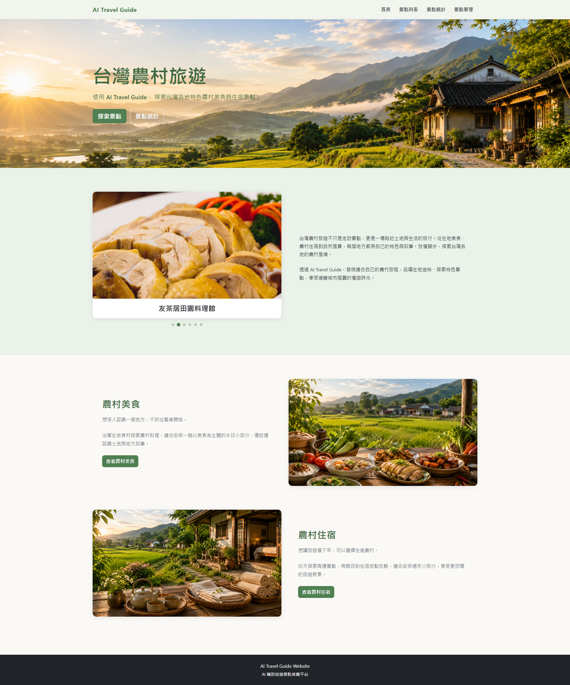
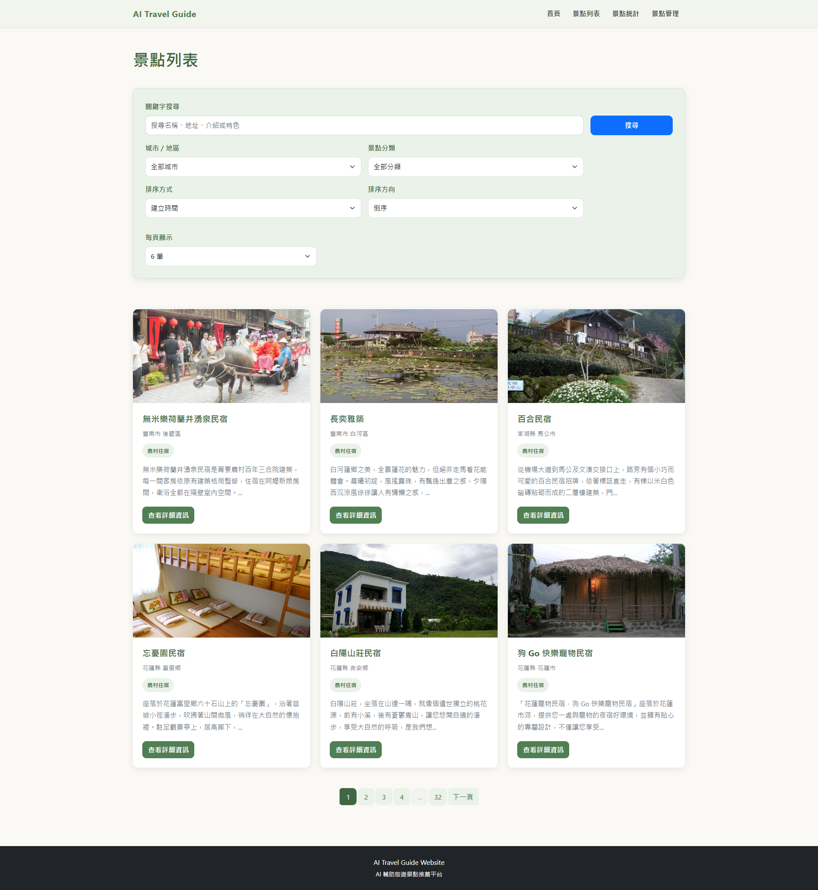
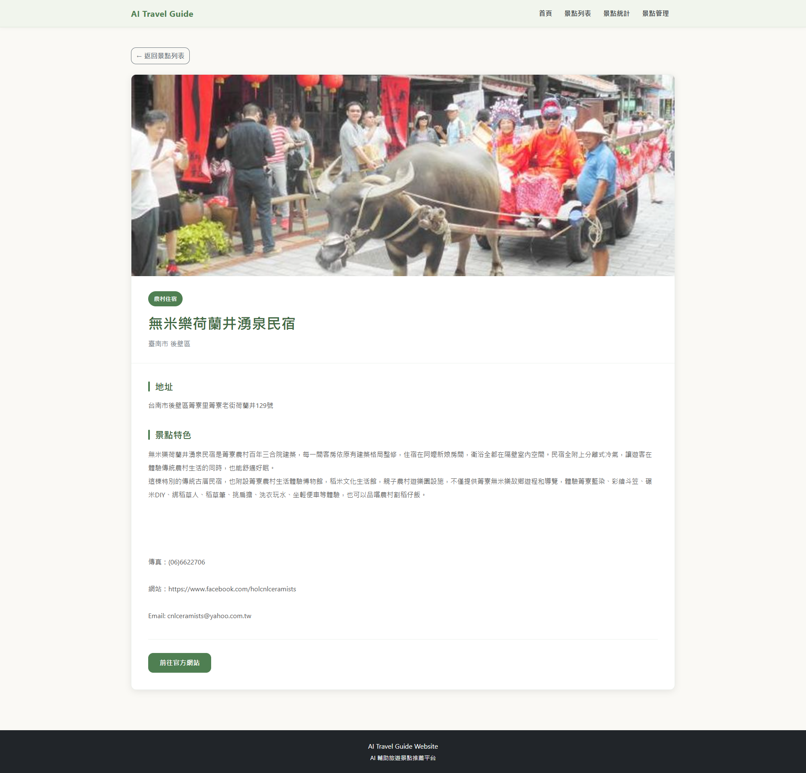
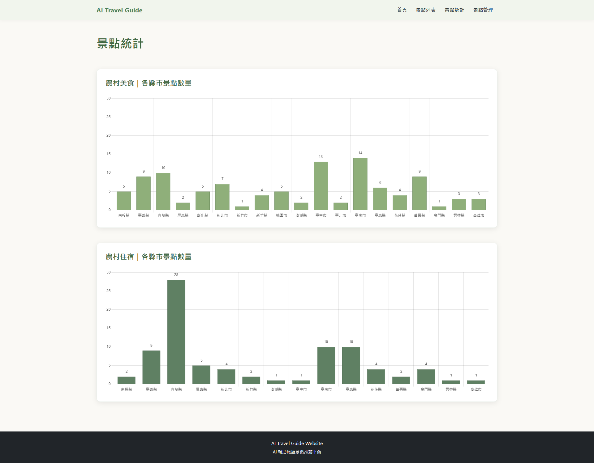
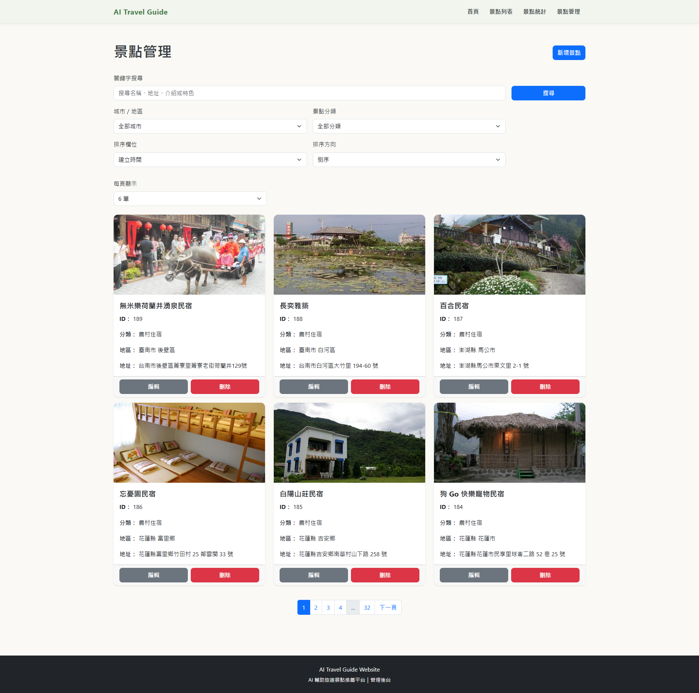
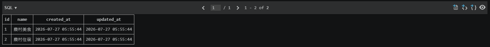
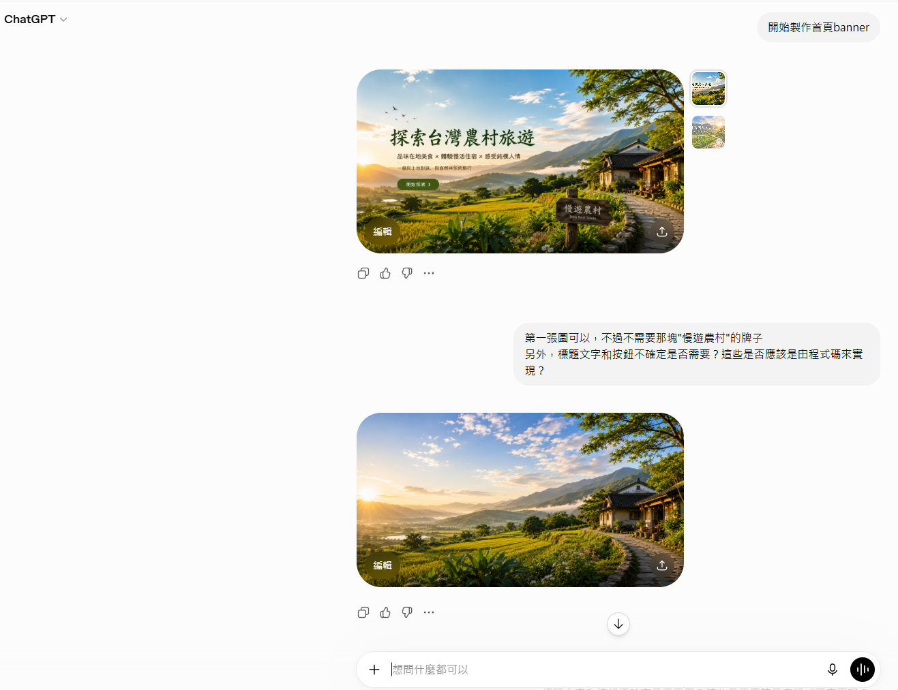
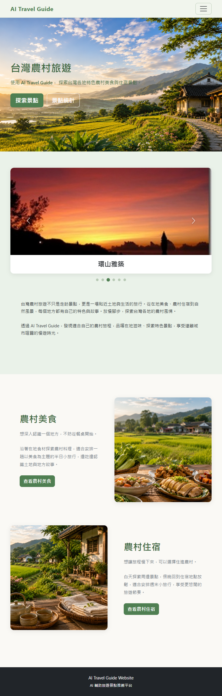
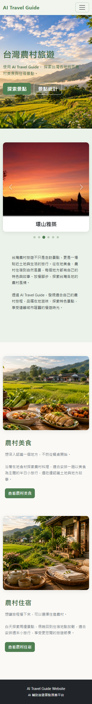

# AI Travel Guide

> AI 輔助台灣農村旅遊景點探索平台  
> 提供農村美食、農村住宿景點的搜尋、篩選、排序、詳細資訊與統計功能。

---

## 1. 專題名稱

### AI Travel Guide

本專題以台灣農村旅遊為主題，整合農村美食與農村住宿資料，建立可供使用者探索景點的旅遊網站。

---

## 2. 專題簡介

AI Travel Guide 是一個以台灣農村旅遊為主題的網站，使用者可以瀏覽各地農村美食與住宿景點，透過關鍵字、城市與分類進行搜尋與篩選，也可以依照不同欄位進行排序及分頁瀏覽。

網站另外提供單一景點詳細資訊、景點統計圖表，以及後台景點管理功能。

---

## 3. 使用技術

| 類別 | 技術 |
|---|---|
| Backend | Laravel 12 |
| Programming Language | PHP 8.2+ |
| Frontend | Blade、HTML、CSS、JavaScript |
| UI Framework | Bootstrap 5.3.3 |
| JavaScript Library | jQuery 4.0.0 |
| HTTP Client | Axios |
| Alert | SweetAlert2 |
| Chart | Chart.js、Chart.js DataLabels |
| Database | SQLite |
| ORM | Laravel Eloquent |
| API | Laravel REST API |
| Build Tool | Vite |
| Version Control | Git / GitHub |

---

## 4. 系統功能說明

### 4.1 首頁

首頁提供：

- Hero 主視覺
- AI 圖像素材(banner、景點導覽視覺圖)
- 精選景點輪播(左右切換、自動播放、指示點)
- 農村美食介紹
- 農村住宿介紹
- 景點導覽按鈕



---

### 4.2 景點列表

景點列表以卡片方式呈現景點資訊。

每張景點卡片包含：

- 景點圖片
- 景點名稱
- 城市／地區
- 景點分類
- 景點簡介
- 查看詳細資訊按鈕

景點列表有提供數個篩選條件，包含：

- 關鍵字搜尋
- 城市／地區篩選
- 景點分類篩選
- 排序依據
- 排序方向
- 每頁顯示筆數
- 分頁

關鍵字搜尋會搜尋：

- 景點名稱
- 地址
- 景點介紹
- 景點特色



---

### 4.3 單一景點詳細資訊

使用者可以進入單一景點頁面查看：

- 景點圖片
- 景點名稱
- 景點分類
- 城市／地區
- 地址
- 景點特色
- 官方網站連結按鈕



---

### 4.4 景點統計

統計頁以縣市來區分農村美食與農村住宿景點數量，呈現出兩張長條圖。

兩張圖使用相同的 Y 軸最大值，並依資料最大值計算為 5 的倍數，使兩張圖能夠直接比較。

X 軸會依畫面寬度即時調整文字大小與排列方向，以維持 RWD 顯示效果。



---

### 4.5 後台景點管理

後台提供景點管理相關功能，包括：

- 景點列表
- 新增景點
- 編輯景點
- 刪除景點
- 表單驗證
- SweetAlert2 操作提示



---

## 5. 資料庫設計

本專案使用 SQLite 儲存景點資料。

主要資料表：

### categories

| 欄位 | 說明 |
|---|---|
| id | 分類編號 |
| name | 分類名稱 |
| created_at | 建立時間 |
| updated_at | 更新時間 |



### attractions

| 欄位 | 說明 |
|---|---|
| id | 景點編號 |
| category_id | 景點分類 |
| name | 景點名稱 |
| city | 城市／縣市 |
| town | 鄉鎮市區 |
| address | 地址 |
| image | 景點圖片 |
| description | 景點介紹 |
| feature | 景點特色 |
| website | 官方網站 |
| created_at | 建立時間 |
| updated_at | 更新時間 |

### Model Relationship

```text
Category
   │
   │ hasMany
   ▼
Attraction

Attraction
   │
   │ belongsTo
   ▼
Category
```

資料庫透過 `category_id` 建立分類與景點的一對多關係。

---

## 6. API 說明

| Method | API | 功能 | 成功狀態碼 | 主要用途 |
|---|---|---|---|---|
| GET | `/api/attractions` | 景點列表 | 200 | 景點查詢、搜尋、篩選、排序、分頁 |
| GET | `/api/attractions/{id}` | 單一景點詳細資訊 | 200 | 取得指定景點 |
| POST | `/api/attractions` | 新增景點 | 201 | 建立景點資料 |
| PUT | `/api/attractions/{id}` | 修改景點 | 200 | 更新景點資料 |
| DELETE | `/api/attractions/{id}` | 刪除景點 | 200 | 刪除景點資料 |
| GET | `/api/statistics` | 景點統計 | 200 | 取得各縣市農村美食與農村住宿數量 |

### 景點列表 API 補充

```http
GET /api/attractions
```

可使用的查詢參數：

| Parameter | 說明 |
|---|---|
| keyword | 關鍵字 |
| city | 城市／地區 |
| category_id | 景點分類 |
| sort | 排序欄位 |
| direction | asc / desc |
| per_page | 每頁筆數 |
| page | 頁碼 |
| random | 是否取得隨機精選景點(首頁輪播用) |


### API Response 格式

API 統一使用 JSON 回傳資料，例如：

```json
{
    "status": "success",
    "message": "景點取得成功",
    "data": {},
    "code": 200
}
```

### API 資料傳遞方式

```text
使用者操作網頁
       ↓
Blade 頁面
       ↓
JavaScript / jQuery
       ↓
Axios
       ↓
Laravel API
       ↓
Controller
       ↓
Eloquent Model
       ↓
SQLite Database
       ↓
JSON Response
       ↓
JavaScript 更新畫面
```

---

## 7. 資料來源

本專案使用農村旅遊相關開放資料建立景點資料。

目前專案中的主要資料檔案：

```text
storage/app/private/data/TravelFood.json
storage/app/private/data/TravelStay.json
```

其中：

- `TravelFood.json`：農村美食資料
- `TravelStay.json`：農村住宿資料

匯入後將資料整理至 SQLite 的 `attractions` 與 `categories` 資料表。

---

## 8. AI 功能說明

本專案使用 AI 輔助製作網站所使用的圖像素材。

目前實際使用於網站的 AI 圖像素材包括：

- 首頁主視覺 Banner
- 農村美食圖片
- 農村住宿圖片

這些圖像素材實際放入首頁及相關內容區塊中，作為網站視覺設計的一部分。



---

## 9. UI / RWD 設計

網站使用 Bootstrap 5.3.3 搭配自訂 CSS 進行版面設計。

整體視覺以：

- 農村自然感的綠色系
- 淺色背景
- 卡片式資訊呈現
- 圓角元件
- 清楚的主要操作按鈕

為主要設計方向。

網站主要頁面皆有進行 RWD 調整，包括：

- Navbar
- 首頁 Hero
- 精選景點輪播
- 首頁景點導覽
- 景點卡片
- 搜尋／篩選區
- 統計圖表
- 景點詳細頁





---

## 10. 介面設計

本專案使用figma製作首頁與景點列表頁設計稿。

figma設計稿：https://www.figma.com/design/TDaA5Wdl6IkzQxjNQO0d92/ICAP%E7%B6%B2%E9%A0%81%E6%A6%82%E7%95%A5%E8%A8%AD%E8%A8%88%E5%9C%96?node-id=0-1&t=kSioXjkoopo3xFMU-1

figma流程圖：https://www.figma.com/board/mkPyn57noxRuzceZGBc0b0/ICAP%E5%B0%88%E6%A1%88%E6%B5%81%E7%A8%8B%E5%9C%96?t=kSioXjkoopo3xFMU-1

---

## 11. Git / GitHub

本專案使用 Git 進行版本控制，並建立 GitHub Repository 管理專案。

### GitHub Repository

https://github.com/antroom232323aaa/icap

---

## 12. 專案頁面路由

| 頁面 | URL |
|---|---|
| 首頁 | `/` |
| 景點列表 | `/attractions` |
| 景點詳細資訊 | `/attractions/{id}` |
| 景點統計 | `/statistics` |
| 後台景點管理 | `/admin/attractions` |

---

## 13. 專案目錄概要

```text
icap/
├── app/
│   ├── Http/
│   │   └── Controllers/
│   └── Models/
├── database/
│   └── migrations/
├── public/
│   ├── css/
│   └── images/
├── resources/
│   └── views/
├── routes/
│   ├── api.php
│   └── web.php
├── storage/
│   └── app/
│       └── private/
│           └── data/
├── tests/
├── composer.json
├── package.json
└── README.md
```

---

## 14. 開發者資訊

姓名：林育弘

聯絡信箱：antroom232323aaa@gmail.com

---

## 15. License

本專案為課程／專題用途之網站作品。
